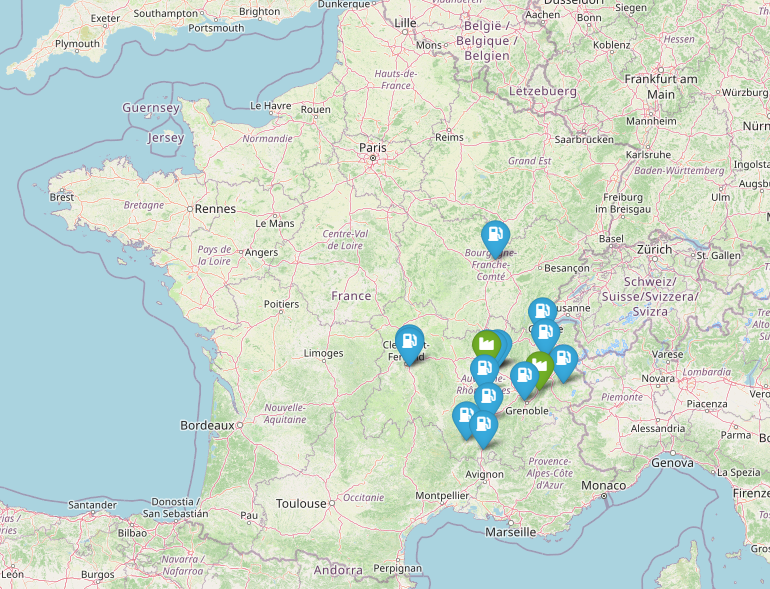
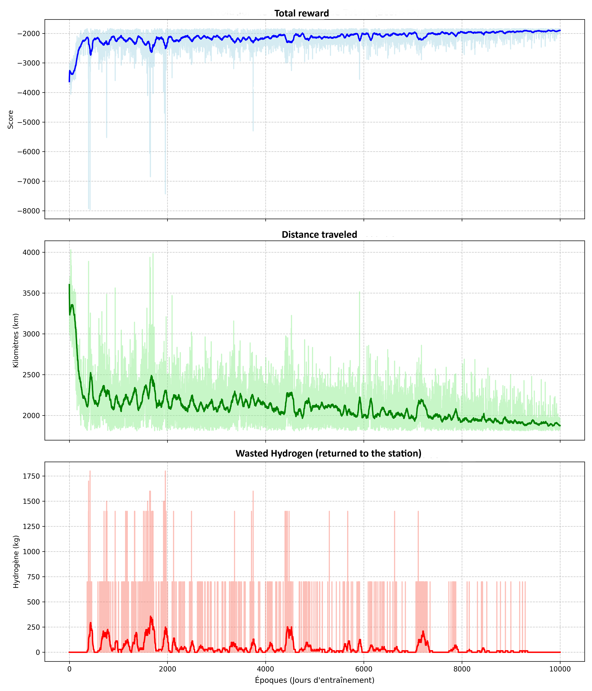

# H2-Logistics-RL: Deep Reinforcement Learning with Attention Mechanisms for Green Hydrogen Routing

A Machine Learning pipeline designed to optimize multi-vehicle hydrogen distribution networks. This repository leverages a custom **Deep Reinforcement Learning** environment coupled with a **Transformer-based Attention Agent** to solve a complex variant of the Vehicle Routing Problem.

---

## 1. Problem Statement & Logistics Context

In the transition toward sustainable energy ecosystems, green hydrogen (H₂) distribution presents a high-stakes logistics bottleneck. Hydrogen possesses a low volumetric energy density, requiring high-pressure or cryogenic transportation in specialized tube trailers. Efficient fleet routing is paramount to minimize carbon footprints and operational costs.

**The Initial Network State:**
To understand the complexity of the geographic distribution, below is the raw geospatial layout of the production depots and demanding stations before optimization:

<p align="center">
  
</p>

This project mathematically models the distribution network as a **Multi-Vehicle Routing Problem with Split Deliveries (SDVRP)**:
* **The Network:** Consists of multiple production sites (Depots/Sources) and a variable number of refueling stations scattered across a territory, each with a specific daily demand (kg/day).
* **Fleet Constraints:** A fleet of heavy-duty transport trucks with fixed payload capacities (700 kg). 
* **Split Deliveries:** If a single station's remaining demand exceeds a truck's available capacity, the truck delivers its remaining load, returns to a depot to refill, and another truck (or the same one on a subsequent trip) fulfills the remainder.
* **Optimization Objectives:** 1. Minimize total fleet mileage (Distance Penalty).
  2. Maximize the trailer fill-rate, minimizing "empty space" brought back to production plants (Hydrogen Waste).
  3. Guarantee 100% demand fulfillment across all stations under strict multi-depot conditions.

---

## 2. Algorithmic Design & Architecture

### Environment (`rl_environment.py`)
Built as a custom Markov Decision Process tracking:
* **State Space:** Dynamic fleet configuration (current truck position, remaining trailer capacity) and the global grid state (remaining unsatisfied demand vector across all nodes).
* **Action Space:** Discrete nodes (refueling stations or active production depots).
* **Action Masking:** A strict rule-based hybrid masking matrix prevents illegal behaviors (e.g., visiting an empty station, trying to serve a client when the trailer is empty, or heading to a depot when the truck is already fully loaded).

### The Attention Agent (`rl_agent.py`)
Instead of a rigid Multi-Layer Perceptron (MLP) which binds the model to a fixed input size, this repository utilizes an **Attention-based Policy Network (Transformer Encoder style)**. 
* **Query:** Encodes the *Truck State* (current coordinates, current load).
* **Keys:** Encodes the *Map/Nodes State* (station coordinates, distance from truck, remaining demand).

By computing **Scaled Dot-Product Attention**, the model maps the continuous spatial topology dynamically. This architecture ensures high **generalizability**, allowing the trained agent to handle an arbitrary number of stations without altering the underlying neural network parameters.

---

## 3. Repository Structure

* `main.py`: Main entry point initializing the pipeline, instantiating parameters, launching the training loop, and parsing terminal execution data.
* `data_processor.py`: Advanced geospatial pipeline utilizing `geopy` (Nominatim API) to clean unstructured addresses, parse explicit GPS coordinates, and handle automated min-max feature normalization.
* `rl_environment.py`: Implements the `HydrogenLogisticsEnv` discrete routing state-machine.
* `rl_agent.py`: Houses the TensorFlow 2.x `LogisticsAttentionAgent` and the REINFORCE Policy Gradient training framework.
* `visualizer.py`: Data viz engine mapping outputs into interactive Folium HTML environments and saving technical evaluation metrics.

---

## 4. Installation & Usage

### Prerequisites
Ensure you have Python 3.10+ installed. Clone the repository and install dependencies:

    git clone https://github.com/your-username/H2-Logistics-RL.git
    cd H2-Logistics-RL
    pip install -r requirements.txt

### Running the Optimizer
To start training the agent on your dataset:

    python main.py

---

## 5. Industrial Performance Evaluation (KPIs)

The pipeline produces a comprehensive evaluation at the end of the execution, combining raw terminal metrics and visualizations.

### A. Routing Results & Fleet Statistics
The model outputs the exact node-to-node sequence for each deployed truck and calculates the global efficiency metrics directly in the console:

```text
=== FLEET RESULT (SPLIT DELIVERY MULTI-VRP) ===
Truck 1 : [DEPOT] -> Station 3 -> Station 1 -> [DEPOT]
Truck 2 : [DEPOT] -> Station 2 -> Station 4 -> [DEPOT]

=== FLEET STATISTICS (KPIs) ===
-> Deployed trucks count : 2
-> Total mobilized capacity  : 1400 kg
-> Total delivered demand    : 1150 kg
-> Unused hydrogen           : 250 kg (Empty space in trailers)
-> Overall fill rate         : 82.1 %
```

### B. Learning Diagnostics Dashboard
The reinforcement learning convergence profile is saved dynamically. It evaluates the optimization across training epochs (Score evolution, Distance reduction, and Waste minimization):



### C. Geospatial Fleet Map (Optimized Routes)
The final vehicle routing schedule is mapped into an interactive HTML layout powered by Folium. It plots green markers for production plants, blue markers for delivery stations, and colored overlay polylines matching individual truck journeys.

[🗺️ Click here to download or view the interactive Route Map](carte_itineraires.html)

---

## 6. Current Limitations & Technical Bottlenecks

While architecturally robust, deploying this solution directly into an industrial control tower introduces specific limitations that define future development branches:

### 1. The "As-The-Crow-Flies" Distance Constraint (Major Bottleneck)
The distance matrix currently relies on the **Haversine formula**, computing geometric distances over a spherical surface ("as the crow flies"). 
* **Real-world gap:** Trucks must navigate physical infrastructure (highways, bridges with weight limits, mountain passes, urban traffic zones). A geometric straight-line approximation severely underestimates actual travel times and fuel consumption, and can lead to unfeasible routes in rugged terrains (e.g., valleys separated by mountain ranges).
* **Mitigation:** Production systems must swap the Haversine matrix with a dedicated Routing API engine like **OSRM (Open Source Routing Machine)** or Google Maps API to fetch exact road-network coordinates and driving distances.

### 2. Static Demand Assumptions
The environment operates under deterministic conditions where demands are known beforehand. Real-world logistics require *Stochastic RL* to adapt to real-time telemetry (IoT sensors on hydrogen tanks reporting sudden drops or delayed deliveries).

### 3. Policy Convergence Limits
Using a standard REINFORCE algorithm with a moving-average baseline can suffer from high variance on large state spaces (e.g., scaling to 500+ distribution points). Transitioning to Actor-Critic architectures (PPO) and vectorizing the environments would be required for global enterprise-scale deployments.
